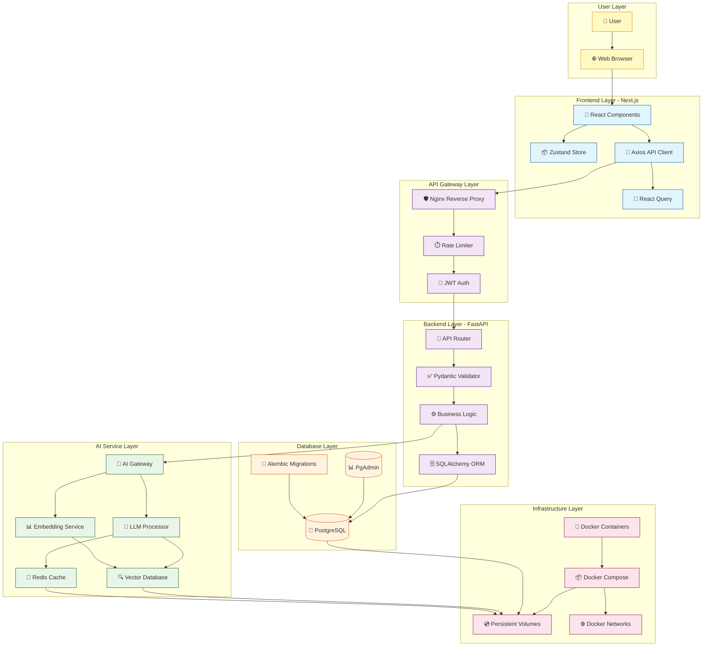
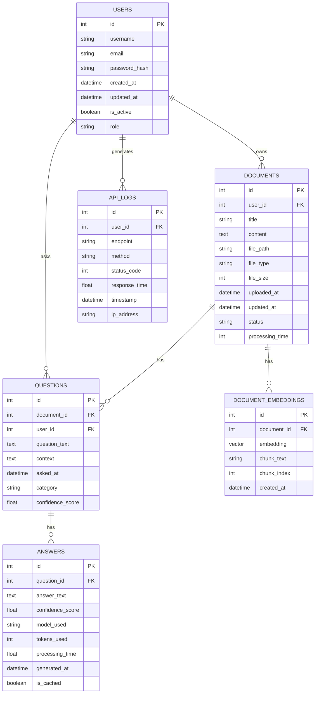

# 🤖 AI-Powered Document Question-Answering System

[](LICENSE)
[](https://nextjs.org/)
[](https://fastapi.tiangolo.com/)
[](https://www.postgresql.org/)
[](https://www.docker.com/)

## 📋 Overview

A production-ready full-stack application that allows users to upload documents and ask intelligent questions about their content using Large Language Models (LLMs). Built with modern technologies and containerized with Docker for seamless deployment.

### 🎯 Key Features

- 📄 **Document Management**: Upload, store, and manage documents
- 🤖 **AI-Powered Q&A**: Ask questions and get intelligent answers using LLMs
- 🔍 **Smart Search**: Semantic search through document content
- 🚀 **Real-time Responses**: Streaming AI responses for better UX
- 📊 **Analytics Dashboard**: Track document usage and AI interactions
- 🔐 **Secure Authentication**: JWT-based user authentication
- 🐳 **Dockerized**: Easy deployment with Docker Compose

### 🏗️ High-Level System Architecture




##  **Database Schema ER Diagram**


    
## 🛠️ Technology Stack

### Frontend
- **Next.js 14**: React framework with App Router
- **TypeScript**: Type-safe JavaScript
- **Tailwind CSS**: Utility-first CSS framework
- **React Query**: Data fetching and caching
- **Axios**: HTTP client
- **Zustand**: State management
- **React Hook Form**: Form handling

### Backend
- **FastAPI**: Modern Python web framework
- **SQLAlchemy**: ORM for database operations
- **Alembic**: Database migrations
- **Pydantic**: Data validation
- **JWT**: Authentication
- **Python-dotenv**: Environment variables

### AI Service
- **OpenAI API**: GPT-4 and GPT-3.5-turbo
- **LangChain**: LLM application framework
- **ChromaDB**: Vector database for embeddings
- **Sentence-Transformers**: Text embeddings

### Database
- **PostgreSQL 15**: Primary database
- **PgAdmin**: Database management
- **psycopg2**: PostgreSQL adapter for Python

### DevOps
- **Docker**: Containerization
- **Docker Compose**: Multi-container orchestration
- **GitHub Actions**: CI/CD pipeline

## 📦 Project Structure
```bash
ai-document-qa-system/
├── frontend/ # Next.js frontend
│ ├── src/
│ │ ├── app/ # App Router pages
│ │ ├── components/ # React components
│ │ ├── hooks/ # Custom React hooks
│ │ ├── services/ # API services
│ │ ├── store/ # Zustand store
│ │ ├── types/ # TypeScript types
│ │ └── utils/ # Utility functions
│ ├── Dockerfile
│ ├── next.config.js
│ ├── package.json
│ └── tailwind.config.js
│
├── backend/ # FastAPI backend
│ ├── app/
│ │ ├── api/ # API endpoints
│ │ ├── core/ # Core configuration
│ │ ├── models/ # SQLAlchemy models
│ │ ├── schemas/ # Pydantic schemas
│ │ ├── services/ # Business logic
│ │ └── utils/ # Utilities
│ ├── Dockerfile
│ ├── requirements.txt
│ └── .env.example
│
├── ai-service/ # AI service
│ ├── app/
│ │ ├── models/ # AI models
│ │ ├── services/ # AI services
│ │ └── utils/ # AI utilities
│ ├── Dockerfile
│ └── requirements.txt
│
├── docker-compose.yml # Docker orchestration
├── .env.example # Environment variables
└── README.md # This file
```

## 🚀 Quick Start

### Prerequisites

- Node.js 18+ and npm
- Python 3.10+
- Docker and Docker Compose
- PostgreSQL 15+ (or use Docker)
- OpenAI API key

###  Using Docker 

```bash
# Clone the repository
git clone https://github.com/https://github.com/TsegayIS122123/AI-Powered-Document-Question-Answering-System
cd AI-Powered-Document-Question-Answering-System

# Copy environment variables
cp .env.example .env

# Edit .env and add your OpenAI API key
# OPENAI_API_KEY=your-key-here

# Start all services
docker-compose up --build

# Access the application
# Frontend: http://localhost:3000
# Backend API: http://localhost:8000
# API Documentation: http://localhost:8000/docs
# AI Service: http://localhost:5000
```

### Local Development

#### Frontend Setup

```bash
cd frontend

# Install dependencies
npm install

# Create .env.local file
echo "NEXT_PUBLIC_API_URL=http://localhost:8000" > .env.local

# Start development server
npm run dev

# Build for production
npm run build
npm start
```

#### Backend Setup

```bash
cd backend

# Create virtual environment
python -m venv venv
source venv/bin/activate  # On Windows: venv\Scripts\activate

# Install dependencies
pip install -r requirements.txt

# Copy environment variables
cp .env.example .env

# Run migrations
alembic upgrade head

# Start server
uvicorn app.main:app --reload --host 0.0.0.0 --port 8000
```

#### AI Service Setup

```bash
cd ai-service

# Create virtual environment
python -m venv venv
source venv/bin/activate  # On Windows: venv\Scripts\activate

# Install dependencies
pip install -r requirements.txt

# Start service
python app.py
```

## 📡 API Documentation

### Endpoints

#### Documents
```
GET    /api/documents               # List all documents
POST   /api/documents               # Upload new document
GET    /api/documents/{id}          # Get document details
PUT    /api/documents/{id}          # Update document
DELETE /api/documents/{id}          # Delete document
```

#### Questions
```
POST   /api/questions              # Ask a question
GET    /api/questions/{id}         # Get question details
GET    /api/documents/{id}/questions # Get questions for a document
```

#### Authentication
```
POST   /api/auth/register          # Register new user
POST   /api/auth/login             # Login user
POST   /api/auth/refresh           # Refresh token
POST   /api/auth/logout            # Logout user
```

### Example API Usage

```bash
# Upload a document
curl -X POST http://localhost:8000/api/documents \
  -H "Authorization: Bearer YOUR_TOKEN" \
  -F "title=My Document" \
  -F "content=Document content here..."

# Ask a question
curl -X POST http://localhost:8000/api/questions \
  -H "Content-Type: application/json" \
  -H "Authorization: Bearer YOUR_TOKEN" \
  -d '{
    "document_id": 1,
    "question": "What is the main topic?"
  }'
```

## 🧪 Testing

```bash
# Backend tests
cd backend
pytest

# Frontend tests
cd frontend
npm test

# Run all tests in Docker
docker-compose -f docker-compose.test.yml up --abort-on-container-exit
```

## 🚢 Deployment

### Deploy to Production

```bash
# Build production images
docker-compose -f docker-compose.prod.yml build

# Start production services
docker-compose -f docker-compose.prod.yml up -d

# Run database migrations
docker-compose -f docker-compose.prod.yml exec backend alembic upgrade head
```

### Cloud Deployment Options

- **Frontend**: Vercel, Netlify, AWS Amplify
- **Backend**: AWS ECS, Google Cloud Run, Heroku
- **Database**: AWS RDS, Google Cloud SQL, Supabase
- **AI Service**: AWS SageMaker, Google Cloud AI Platform

## 🔒 Security Features

- ✅ JWT-based authentication
- ✅ Password hashing (bcrypt)
- ✅ SQL injection prevention (SQLAlchemy)
- ✅ CORS configuration
- ✅ Rate limiting
- ✅ Input validation
- ✅ Environment variables
- ✅ HTTPS enforcement in production

## 📊 Monitoring & Logging

- **Backend**: FastAPI's built-in logging
- **Frontend**: Error tracking with Sentry
- **Database**: PostgreSQL query logging
- **Docker**: Log aggregation with ELK stack

## 🤝 Contributing

1. Fork the repository
2. Create your feature branch (`git checkout -b feature/AmazingFeature`)
3. Commit your changes (`git commit -m 'Add some AmazingFeature'`)
4. Push to the branch (`git push origin feature/AmazingFeature`)
5. Open a Pull Request

## 📝 License

This project is licensed under the MIT License - see the [LICENSE](LICENSE) file for details.

## 🙏 Acknowledgments

- OpenAI for the amazing API
- FastAPI community
- Next.js team
- Docker team
- All open-source contributors

## 📧 Contact

Project Link: [https://github.com/TsegayIS122123/AI-Powered-Document-Question-Answering-System](https://github.com/TsegayIS122123/AI-Powered-Document-Question-Answering-System)

---

## ⭐ Support

If you find this project helpful, please give it a star ⭐
```

---

## Step 3: Frontend Setup Guide

### Frontend Code Structure and Explanation

#### **1. Initialize Frontend Project**

```bash
# Create Next.js project with TypeScript
cd frontend
npx create-next-app@latest . --typescript --tailwind --eslint

# Install required dependencies
npm install axios react-query zustand react-hook-form @hookform/resolvers yup
npm install @tanstack/react-query-devtools
npm install class-variance-authority clsx tailwind-merge
```

